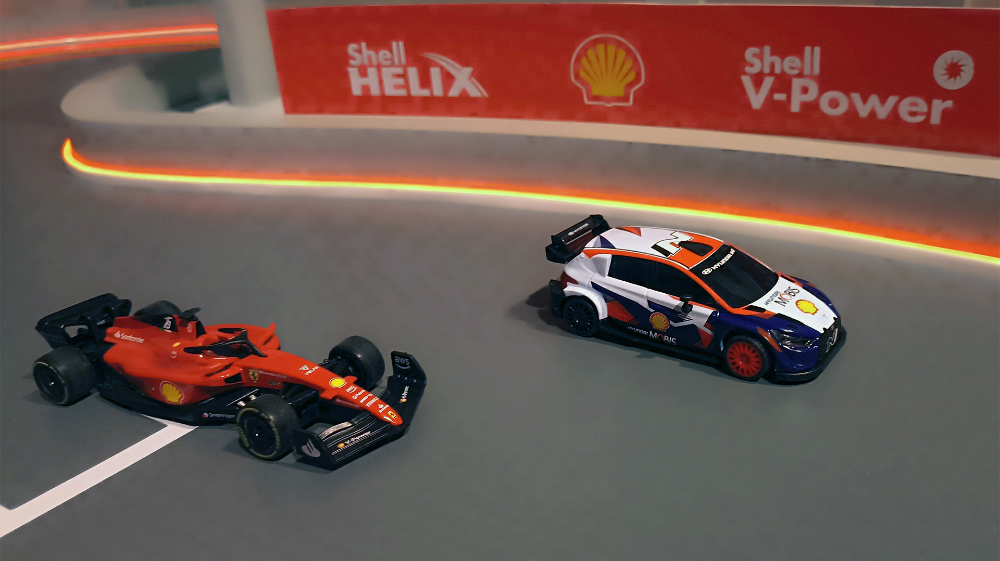
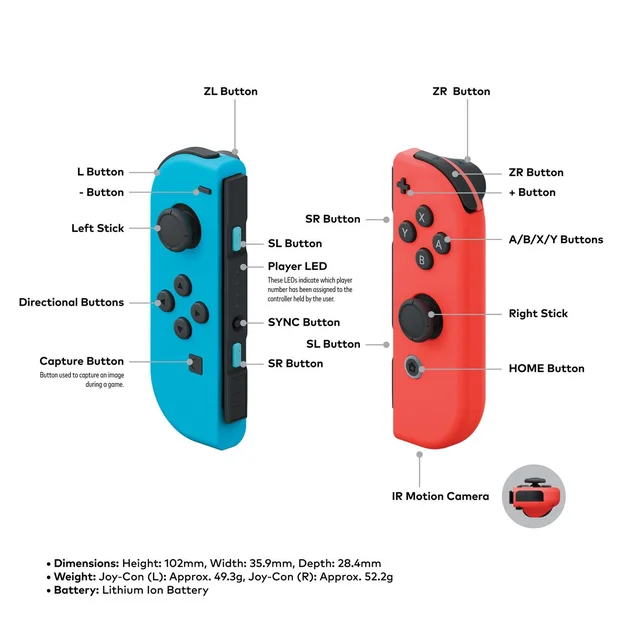

# Shell Motorsport RC Car Control Library



Esta librería permite controlar los autos de radio control (RC) de Shell Motorsport a través de Bluetooth Low Energy (BLE). Proporciona funciones para conectarse al vehículo, enviar comandos de movimiento y administrar múltiples autos.

## Características

- ✅ Control de autos RC vía Bluetooth Low Energy (BLE)
- ✅ Soporte para múltiples vehículos simultáneos
- ✅ Control con JoyCon de Nintendo Switch
- ✅ Mensajes precomputados para mejor rendimiento
- ✅ Manejo robusto de errores y reconexión
- ✅ Soporte para context managers (async with)
- ✅ Type hints completos
- ✅ Logging configurable
- ✅ Validación de comandos

## Instalación

### Opción 1: Via PIP

```shell
pip install git+https://github.com/AMasetti/shell-motorsport-rc-lib
```

### Opción 2: Clonar el Repositorio

1. Clona este repositorio:
    ```shell
    git clone https://github.com/AMasetti/shell-motorsport-rc-lib.git
    ```

2. Navega al directorio del proyecto:
    ```shell
    cd shell-motorsport-rc-lib
    ```

3. Instala las dependencias requeridas:
    ```shell
    pip install -r requirements.txt
    ```

### Dependencias Opcionales

Para usar JoyCon controllers, instala las dependencias adicionales:

```shell
pip install "shell_motorsport[joycon]"
```

O manualmente:

```shell
pip install joycon-python hidapi pyglm
```

## Uso Básico

### Ejemplo Simple

```python
import asyncio
from shell_motorsport import ShellMotorsportCar

async def main():
    car = ShellMotorsportCar()

    try:
        # Conectar por nombre (buscará y nombrará si no existe)
        if "MI_AUTO" not in car.vehicle_list:
            await car.find_and_name_car("MI_AUTO")
        await car.connect_by_name("MI_AUTO")

        # Mover hacia adelante por 1 segundo
        await car.move_forward(duration=1.0)

        # Mover hacia atrás
        await car.move_backward(duration=1.0)

        # Detener
        await car.stop()

    finally:
        await car.disconnect()

if __name__ == "__main__":
    asyncio.run(main())
```

### Usando Context Manager

```python
import asyncio
from shell_motorsport import ShellMotorsportCar

async def main():
    async with ShellMotorsportCar() as car:
        await car.connect_by_name("MI_AUTO")
        await car.move_forward(duration=1.0)
        # Desconexión automática al salir del bloque

asyncio.run(main())
```

### Control Manual con Mensajes Precomputados

```python
import asyncio
from shell_motorsport import ShellMotorsportCar

async def main():
    car = ShellMotorsportCar()

    try:
        await car.connect_by_name("MI_AUTO")

        # Mover hacia adelante
        message = car.retrieve_precomputed_message(forward=1, speed=0x64)
        await car.move_command(message)
        await asyncio.sleep(1)

        # Mover hacia atrás y a la izquierda
        message = car.retrieve_precomputed_message(backward=1, left=1)
        await car.move_command(message)
        await asyncio.sleep(1)

        await car.stop()

    finally:
        await car.disconnect()
```

## Descubrir y Registrar Autos

Para descubrir el `device_id` de tu auto y asignarle un nombre personalizado:

1. Enciende tu auto RC y asegúrate de que esté en modo de emparejamiento.

2. En tu script, usa `find_and_name_car()`:
    ```python
    car = ShellMotorsportCar()
    await car.find_and_name_car("MI_AUTO")
    ```

3. El programa buscará dispositivos BLE cercanos, encontrará tu auto y guardará su `device_id` en el archivo `vehicle_list.json`.

4. Luego puedes conectarte usando el nombre:
    ```python
    await car.connect_by_name("MI_AUTO")
    ```

## Controlar Múltiples Vehículos

La librería permite controlar múltiples autos RC simultáneamente:

```python
import asyncio
from shell_motorsport import ShellMotorsportCar

async def main():
    car1 = ShellMotorsportCar()
    car2 = ShellMotorsportCar()

    try:
        await car1.connect_by_name("AUTO_1")
        await car2.connect_by_name("AUTO_2")

        # Controlar car1
        await car1.move_forward(duration=1.0)

        # Controlar car2
        await car2.move_backward(duration=1.0)

    finally:
        await car1.disconnect()
        await car2.disconnect()
```

## Soporte para JoyCon



La librería soporta control de los autos RC utilizando los controladores JoyCon de Nintendo Switch. Puedes controlar múltiples autos simultáneamente usando los JoyCon Plus y Minus.

### Instalación de Dependencias Adicionales

```shell
pip install "shell_motorsport[joycon]"
```

O manualmente:

```shell
pip install joycon-python hidapi pyglm
```

### Uso con JoyCon

```python
import asyncio
from shell_motorsport import ShellMotorsportCar
from pyjoycon import JoyCon, get_R_id, get_L_id

car_name_plus = "AUTO_PLUS"
car_name_minus = "AUTO_MINUS"

joycon_plus = JoyCon(*get_R_id())
joycon_minus = JoyCon(*get_L_id())

async def main():
    car_plus = ShellMotorsportCar()
    car_minus = ShellMotorsportCar()

    try:
        await car_plus.connect_by_name(car_name_plus)
        await car_minus.connect_by_name(car_name_minus)

        speed_plus = 0x50
        speed_minus = 0x50

        async def update_status():
            while True:
                status_plus = joycon_plus.get_status()
                status_minus = joycon_minus.get_status()
                yield status_plus, status_minus
                await asyncio.sleep(0.005)

        async for status_plus, status_minus in update_status():
            command_plus = car_plus.get_joycon_command(
                status_plus, "Plus", speed_plus
            )
            command_minus = car_minus.get_joycon_command(
                status_minus, "Minus", speed_minus
            )

            # Actualizar velocidad basada en botones
            _, _, _, _, speed_plus = car_plus.joycon_handler.parse_joycon_status(
                status_plus, "Plus", speed_plus
            )
            _, _, _, _, speed_minus = car_minus.joycon_handler.parse_joycon_status(
                status_minus, "Minus", speed_minus
            )

            await car_plus.move_command(command_plus)
            await car_minus.move_command(command_minus)

    finally:
        await car_plus.disconnect()
        await car_minus.disconnect()

if __name__ == "__main__":
    asyncio.run(main())
```

### Controles JoyCon

#### JoyCon Plus (Derecho)
- **SR**: Avanzar
- **SL**: Retroceder
- **Stick Analógico Y**: Girar izquierda/derecha
- **A**: Velocidad baja (0x16)
- **B**: Velocidad media (0x32)
- **Y**: Velocidad alta (0x48)
- **X**: Velocidad máxima (0x64)

#### JoyCon Minus (Izquierdo)
- **SR**: Avanzar
- **SL**: Retroceder
- **Stick Analógico Y**: Girar izquierda/derecha
- **←**: Velocidad baja (0x16)
- **↓**: Velocidad media (0x32)
- **→**: Velocidad alta (0x48)
- **↑**: Velocidad máxima (0x64)

## Selección de Velocidad

Puedes seleccionar diferentes niveles de velocidad para tu auto RC. Las velocidades predefinidas son:

- **0x16**: Velocidad baja
- **0x32**: Velocidad media
- **0x48**: Velocidad alta
- **0x64**: Velocidad máxima

### Personalización de Velocidad

Puedes usar velocidades personalizadas:

```python
# Usar velocidad personalizada
message = car.retrieve_precomputed_message(forward=1, speed=0x40)
await car.move_command(message)
```

O modificar los perfiles de velocidad en `config.py`:

```python
DEFAULT_SPEED_PROFILES = {
    "low": 0x16,
    "medium": 0x32,
    "high": 0x48,
    "max": 0x64,
}
```

## API Reference

### ShellMotorsportCar

#### Métodos Principales

- `connect(device_id: str) -> None`: Conecta a un auto por device_id
- `connect_by_name(car_name: str) -> None`: Conecta a un auto por nombre registrado
- `disconnect() -> None`: Desconecta del auto actual
- `move_command(message: bytes) -> None`: Envía un comando de movimiento
- `stop() -> None`: Detiene el auto
- `find_and_name_car(new_name: str) -> BLEDevice`: Busca y registra un nuevo auto
- `find_car(device_id: str) -> BLEDevice`: Busca un auto específico

#### Métodos de Conveniencia

- `move_forward(speed: int = 0x50, duration: Optional[float] = None) -> None`
- `move_backward(speed: int = 0x50, duration: Optional[float] = None) -> None`

#### Métodos de Utilidad

- `list_vehicles() -> Dict[str, str]`: Lista todos los vehículos registrados
- `get_device_id(car_name: str) -> Optional[str]`: Obtiene el device_id de un auto
- `is_connected() -> bool`: Verifica si está conectado
- `get_connection_status() -> Dict[str, any]`: Obtiene estado de conexión
- `retrieve_precomputed_message(...) -> bytes`: Obtiene mensaje precomputado
- `get_joycon_command(status: Dict, device_type: str, current_speed: int) -> bytes`

## Configuración

### Variables de Entorno

Puedes configurar rutas de archivos usando variables de entorno:

```shell
export SHELL_MOTORSPORT_VEHICLE_LIST="/path/to/vehicles.json"
export SHELL_MOTORSPORT_COMMANDS_FILE="/path/to/commands.json"
```

### Archivos de Configuración

- `vehicle_list.json`: Almacena nombres y device_ids de vehículos
- `car_commands.json`: Almacena mensajes precomputados (generado automáticamente)

## Precomputar Mensajes

Para mejorar el rendimiento, puedes precomputar todos los mensajes posibles:

```python
car = ShellMotorsportCar()
car.precompute_messages()
```

Esto generará y guardará todos los mensajes posibles en `car_commands.json`.

## Funcionamiento del Protocolo de Comunicación

Los autos RC de Shell utilizan Bluetooth Low Energy (BLE) para comunicarse. La librería maneja el protocolo de comunicación que incluye:

- **Mensajes cifrados**: Los comandos se encriptan utilizando AES-128 en modo ECB.
- **Servicios y características BLE**: Se utiliza el servicio con UUID `fff0` y las características de escritura y notificación correspondientes.
- **Formato de los mensajes**: Los mensajes de control tienen una longitud de 16 bytes y contienen información sobre dirección (avance, retroceso, izquierda, derecha) y velocidad.

Para obtener más detalles técnicos, consulta la siguiente [documentación](https://gist.github.com/scrool/e79d6a4cb50c26499746f4fe473b3768) con toda la información de los protocolos y formato de los mensajes.

## Testing

Para ejecutar los tests:

```shell
pip install "shell_motorsport[dev]"
pytest
```

## Troubleshooting

### El auto no se encuentra

- Asegúrate de que el auto esté encendido y en modo de emparejamiento
- Verifica que Bluetooth esté habilitado en tu sistema
- Intenta aumentar el tiempo de escaneo en `config.py`

### Error de conexión

- Verifica que el auto esté cerca (BLE tiene alcance limitado)
- Asegúrate de que ningún otro dispositivo esté conectado al auto
- Revisa los logs para más detalles

### JoyCon no funciona

- Verifica que las dependencias de JoyCon estén instaladas
- Asegúrate de que los JoyCon estén emparejados con tu sistema
- Verifica los permisos de acceso USB/HID en tu sistema

## Contribuir

Las contribuciones son bienvenidas. Por favor:

1. Fork el repositorio
2. Crea una rama para tu feature (`git checkout -b feature/AmazingFeature`)
3. Commit tus cambios (`git commit -m 'Add some AmazingFeature'`)
4. Push a la rama (`git push origin feature/AmazingFeature`)
5. Abre un Pull Request

## Licencia

Este proyecto está bajo la Licencia MIT. Ver el archivo `LICENSE` para más detalles.

## Agradecimientos

Queremos expresar nuestro agradecimiento a [Scrool](https://github.com/scrool) por sus valiosas contribuciones en la ingeniería inversa, que han sido fundamentales para este proyecto.

## Changelog

### v0.2.0
- Refactorización completa del código
- Separación en módulos (BLE, encriptación, JoyCon)
- Mejoras en manejo de errores
- Soporte para context managers
- Type hints completos
- Mejoras en logging
- Validación de comandos
- Deadzone para JoyCon
- Mejoras en documentación

### v0.1.1
- Versión inicial con soporte básico
